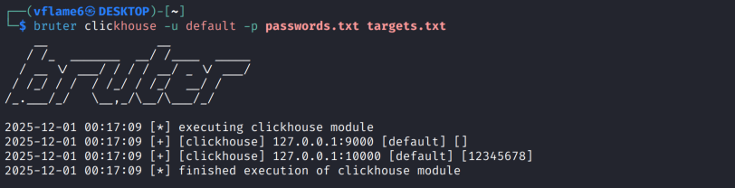

<h1 align="center">
  bruter
</h1>

<h4 align="center">Active network services bruteforce tool.</h4>

<p align="center">
<a href="https://goreportcard.com/report/github.com/vflame6/bruter" target="_blank"></a>
<a href="https://github.com/vflame6/bruter/issues"></a>
<a href="https://github.com/vflame6/bruter/releases"></a>
</p>

---

`bruter` is a network services bruteforce tool. It supports several services and can be improved to support more.

## Features



Available modules:

- `clickhouse`
- `ftp`
- `mongo`
- `smpp`

## Usage

```shell
bruter -h
```

Here is a help menu for the tool:

```yaml
usage: bruter --username=USERNAME --password=PASSWORD [<flags>] <command> [<args> ...]

  bruter is a network services bruteforce tool.

Flags:
  -h, --[no-]help             Show context-sensitive help (also try --help-long
  and --help-man).
  -q, --[no-]quiet            Enable quiet mode, print results only
  -D, --[no-]debug            Enable debug mode, print all logs
  -o, --output=""             Filename to write output in raw format
  -T, --parallelism=32        Number of targets in parallel
  -t, --threads=10            Number of threads per target
  -d, --delay=0               Delay in millisecond between each attempt.
  Will always use single thread if set
  --timeout=5             Connection timeout in seconds
  --[no-]stop-on-success  Stop bruteforcing host on first success
  -u, --username=USERNAME     Username or file with usernames
  -p, --password=PASSWORD     Password or file with passwords
  --[no-]version          Show application version.

Commands: clickhouse ftp mongo smpp
```

Targets are specified in format `IP` or `IP:PORT`. If `PORT` is not specified, the tool uses the default one (for example: `9000` for ClickHouse). 

You can also specify a file to parse. The format for targets file is shown below:  

```
192.168.0.11
192.168.0.12:12345
192.168.0.13:54321
```

The tool performs a check for default credentials (hardcoded) for applicable services. It also determines if an encryption is used on the service for later use.

## Installation

`bruter` requires **go1.25** to install successfully.

```shell
go install -v github.com/vflame6/bruter@latest
```
