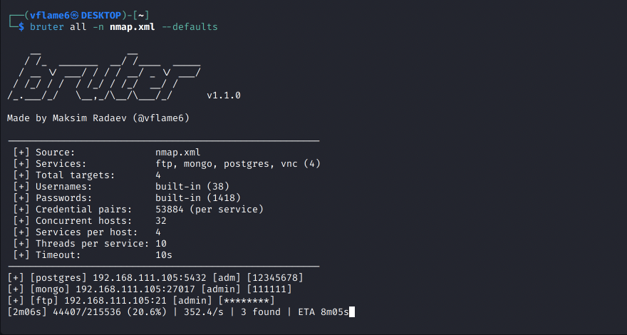

<h1 align="center">
  bruter
</h1>

<h4 align="center">Active network services bruteforce tool.</h4>

<p align="center">
<a href="https://goreportcard.com/report/github.com/vflame6/bruter" target="_blank"></a>
<a href="https://github.com/vflame6/bruter/issues"></a>
<a href="https://github.com/vflame6/bruter/releases"></a>
<a href="https://t.me/vflame6"></a>
</p>

Created by Maksim Radaev/[@vflame6](https://github.com/vflame6)

---

`bruter` is a fast, concurrent network services bruteforce tool written in Go. It supports 53 protocols, scan file auto-detection, and flexible wordlist options — built for pentesters who need reliable credential testing at scale.

## Features



- **Scan file auto-detection** — feed nmap (GNMAP/XML), Nessus, or Nexpose output directly
- **Built-in default wordlists** — usernames and passwords with `--defaults`
- **Parallel execution** — configurable per-host threading and concurrent hosts
- **Smart probing** — auto-detects TLS and tests default credentials before brute
- **SOCKS5 proxy support** — with optional proxy authentication
- **Interface binding** — bind to a specific network interface with `-I`

### Available Modules

| Category | Modules |
|----------|---------|
| **Remote Access** | `ssh`, `sshkey`, `rdp`, `winrm`, `telnet`, `rexec`, `rlogin`, `rsh`, `vnc`, `radmin`, `vmauthd` |
| **Databases** | `mysql`, `mssql`, `postgres`, `oracle`, `mongo`, `redis`, `clickhouse`, `cassandra`, `neo4j`, `etcd`, `influxdb`, `firebird`, `memcached`, `couchdb`, `elasticsearch` |
| **Mail** | `smtp`, `smtp-enum`, `imap`, `pop3`, `nntp` |
| **Web / HTTP** | `http-basic`, `http-form`, `http-proxy`, `vault` |
| **Directory** | `ldap`, `ldaps` |
| **File Sharing** | `ftp`, `smb`, `svn` |
| **Messaging** | `irc`, `xmpp`, `smpp`, `amqp` |
| **Network** | `socks5`, `snmp`, `rtsp`, `rpcap` |
| **VoIP** | `asterisk`, `teamspeak`, `sip` |
| **Cisco** | `cisco`, `cisco-enable` |
| **Industrial** | `s7` |
| **Other** | `cobaltstrike` |

## Usage

```
bruter -h
```

This will display help for the tool. Here are all the switches it supports.

```yaml
usage: bruter [<flags>] <command> [<args> ...]

bruter is a network services bruteforce tool.

Flags:
  -h, --[no-]help              Show context-sensitive help (also try --help-long and --help-man).
  -t, --target=TARGET          Target host or file with targets. Format host or host:port, one per line
  -n, --nmap=NMAP              Scan output file (nmap GNMAP/XML, Nessus .nessus, Nexpose XML — auto-detected). Use with 'all' command.
  -u, --username=USERNAME      Username or file with usernames
  -p, --password=PASSWORD      Password or file with passwords
      --combo=COMBO            Combo wordlist file with user:pass pairs, one per line
      --[no-]defaults          Use built-in default username and password wordlists (user-specified -u/-p take priority)
  -C, --concurrent-hosts=32    Number of targets in parallel
  -c, --concurrent-threads=10  Number of parallel threads per target
  -d, --delay=0s               Delay between each attempt. Will always use single thread if set
      --timeout=5s             Connection timeout in seconds
  -f, --[no-]stop-on-success   Stop bruteforcing current host when first valid credentials found (-f per host, -F global)
  -F, --[no-]stop-on-success-global  
                               Stop the entire run on first successful login across all hosts
      --max-retries=30         Number of connection errors to stop bruteforce the host. Specify 0 to disable this behavior
      --proxy=""               SOCKS-proxy address to use for connection in format IP:PORT
      --proxy-auth=""          Proxy username and password in format username:password
  -I, --iface=""               Network interface to bind outgoing connections to (e.g. eth0)
      --user-agent="Mozilla/5.0 (Windows NT 10.0; Win64; x64) AppleWebKit/537.36 (KHTML, like Gecko) Chrome/143.0.0.0 Safari/537.36"  
                               User-Agent for HTTP connections
  -q, --[no-]quiet             Enable quiet mode, print results only
  -D, --[no-]debug             Enable debug mode, print all logs
  -v, --[no-]verbose           Enable verbose mode, log every attempt with timestamp
  -j, --[no-]json              Output results as JSONL (one JSON object per line)
  -o, --output=""              Filename to write output in raw format
      --[no-]version           Show application version.

Commands: all amqp asterisk cassandra cisco cisco-enable clickhouse cobaltstrike couchdb elasticsearch etcd firebird ftp http-basic http-form http-proxy imap influxdb irc ldap ldaps memcached mongo mssql mysql neo4j nntp oracle pop3 postgres radmin rdp redis rexec rlogin rpcap rsh rtsp s7 sip smb smpp smtp smtp-enum snmp socks5 ssh sshkey svn teamspeak telnet vault vmauthd vnc winrm xmpp 
```

### Quick Examples

**Brute-force SSH with a password list:**

```shell
bruter ssh -t 192.168.1.10 -u root -p /usr/share/wordlists/passwords.txt
```

**Multiple targets from a file:**

```shell
bruter ssh -t targets.txt -u users.txt -p passwords.txt -C 50 -c 5
```

**Use built-in default wordlists:**

```shell
bruter mysql -t 10.0.0.5:3306 --defaults
```

**Auto-detect from nmap scan:**

```shell
nmap -sV -oG scan.gnmap 10.0.0.0/24
bruter all -n scan.gnmap --defaults
```

### Target Format

Targets use `host` or `host:port` format. If port is omitted, the module default is used.

```
192.168.0.11
192.168.0.12:2222
10.0.0.0/24
```

## Installation

`bruter` requires **Go 1.25+** to install successfully.

```shell
go install -v github.com/vflame6/bruter@latest
```

Pre-compiled binaries are available on the [Releases](https://github.com/vflame6/bruter/releases) page.

Build from source:

```shell
git clone https://github.com/vflame6/bruter.git
cd bruter
go build -o bruter main.go
```

Build with Docker:

```shell
docker build -t bruter .
docker run --rm bruter ssh -t 10.0.0.1 -u admin -p passwords.txt
```

## Contributing

Contributions are welcome! Feel free to open an issue or submit a pull request. New module ideas, bug reports, and feature requests are all appreciated.
